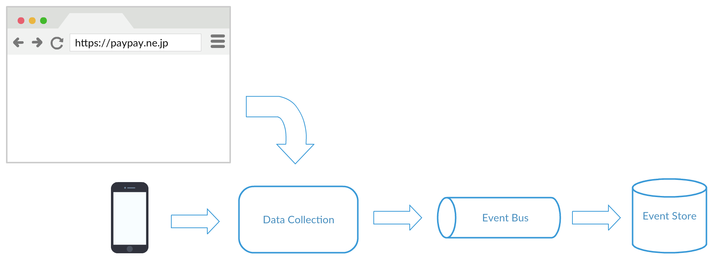
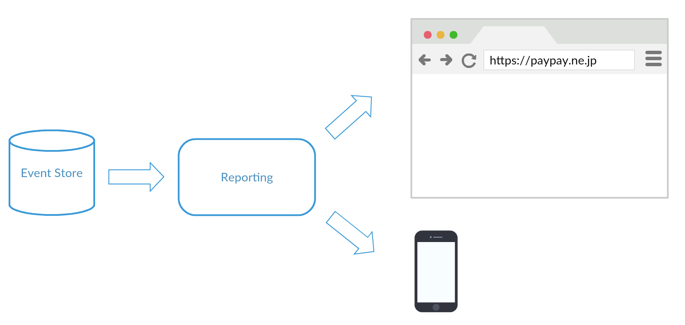

#### Software Engineer Challenge (from https://github.com/Pay-Baymax/SoftwareEngineerChallenge)
1. Coding task:

    In object-oriented and functional programming, an immutable object is an object whose state cannot be modified after it is created. This is in contrast to a mutable object which can be modified after it is created. 

    Classes should be immutable unless there's a very good reason to make them mutable. If a class cannot be made immutable, limit its mutability as much as possible. The JDK contains many immutable classes, including String, the boxed primitive classes, and BigInteger and etc. Basically the immutable classes are less prone to error. 

    Please implement an immutable queue with the following api:
    
    Scala Version:
    ```scala
    trait Queue[T] {
      def isEmpty: Boolean
      def enQueue(t: T): Queue[T]
      # Removes the element at the beginning of the immutable queue, and returns the new queue.
      def deQueue(): Queue[T]
      def head: Option[T]
    }
    object Queue {
      def empty[T]: Queue[T] = ???
    }
    ```

    Java Version:
    ```java
    public interface Queue<T> {
        public Queue<T> enQueue(T t);
        #Removes the element at the beginning of the immutable queue, and returns the new queue.
        public Queue<T> deQueue();
        public T head();
        public boolean isEmpty();
    }
    ```
    **Features are tested in [QueueFeature.kt](src/test/kotlin/challenge/paypay/QueueFeature.kt)**

2. Design Question: Design A Google Analytic like Backend System.
    We need to provide Google Analytic like services to our customers. Pls provide a high level solution design for the backend system. Feel free to choose any open source tools as you want.
    
    The system needs to:

    1) handle large write volume: Billions write events per day.
    
    2) handle large read/query volume: Millions merchants want to get insight about their business. Read/Query patterns are time-series related metrics. 
    
    3) provide metrics to customers with at most one hour delay.
    
    4) run with minimum downtime.
    
    5) have the ability to reprocess historical data in case of bugs in the processing logic.
---
## Proposal for the question 2:

In order to create a Google Analytic like services, we will have the following components
- Data collection
- Reporting

To archive High Availability (minimum downtime, or even no downtime), we could introduce Microservices architecture as it help us to reduce the single point of failure.

Example:
If the Data collection component is down, the Reporting component is still providing service to the end user.

So, by using the Microservices architecture, we could enjoy the High Availability in system level.
Beside the system level HA, microsercies also make the application easier to deploy and scale horizontally. Therefore, each component would be very easy to form a cluster and add new nodes when needed.

On the other hand, it is also compile to the Command and Query Responsibility Segregation ([CQRS](https://martinfowler.com/bliki/CQRS.html)) pattern.
One of the main benefit is in handling high performance applications.
CQRS allows you to separate the load from reads and writes allowing you to scale each independently.

Based on the nature and the requirement of the service, Event Sourcing (this [article](https://martinfowler.com/eaaDev/EventSourcing.html) explain this approach comprehensively) would be a very good candidate where it provides:
>- Complete Rebuild: We can discard the application state completely and rebuild it by re-running the events from the event log on an empty application.
>- Temporal Query: We can determine the application state at any point in time. Notionally we do this by starting with a blank state and rerunning the events up to a particular time or event. We can take this further by considering multiple time-lines (analogous to branching in a version control system).
>- Event Replay: If we find a past event was incorrect, we can compute the consequences by reversing it and later events and then replaying the new event and later events. (Or indeed by throwing away the application state and replaying all events with the correct event in sequence.) The same technique can handle events received in the wrong sequence - a common problem with systems that communicate with asynchronous messaging.

It could fulfill the requirement of **"have the ability to reprocess historical data in case of bugs in the processing logic"**

Besides, eventual consistency approach used in Event Sourcing will be totally suitable in our case:
- it offers low latency
- stale data for read is acceptable as we can tolerance some delays (an hour) 

Now, we will go into the component design.

#### Data collection
It is expected to receive the data (Page information, Browser information, User information, Customizing information) sent from the client side.

By using Event Sourcing, the duty of this component is very simple
- persist the in-coming event into the Event Store

And this component shall just persist what it is received without any processing.
It is because, by using Event Sourcing approach, we need to make the event logs re-buildable.
So, if we persist the processed event into Event Store, once there is a bug,
the historical data will be polluted and the projection of replaying the event logs will be wrong forever.

As we have to **"handle large write volume: Billions write events per day"**, we may need more nodes in the cluster.
So, it would be great if we can put this component on an elastic environment, AWS like infrastructure, then the component could be scaled based on the demand automatically.

On the other hand, if we need an extremely high performance, we can make the endpoint (if we use RESTful) to just receive the data from the client side and then publish it to an event bus.
Then, create a handler to subscribe the event in the event bus and persist the event into Event Store.
By using this design, there will have no blocking thread in the application.

Example:


#### Event Store
An event store is a type of database optimized for storage of events.

It must have the following characteristics:
- event in the store must be immutable
- the event must be stored in the same order as when the data came in
- High Availability that it can run as a cluster of nodes containing the same data,
  which remains available for writes provided at least half the nodes are alive and connected.

We can either build the Event Store or use 3rd party Event Store, e.g: [Event Store](https://eventstore.org/) and [Eventuate](http://eventuate.io/).

If we build it ourselves, it is better to use NoSQL DB (e.g: [Apache Cassandra](http://cassandra.apache.org/)) where
- No schema is required. Otherwise every modification of your model would result in having to migrate your database
- work perfectly under the distributed environment and shall have better performance.

#### Reporting/Event Handler
The responsibility of this component is to build the projection of the event logs received from the Event Store.

It must be flexible enough to query the events by specific criteria like time and dimensions.
In other to build the projection (the result the user is interested in), it will
1. retrieve the events from Event Store by specified filtering criteria and the result will be order by the event creation time
2. This component will then replay ALL the retrieved events to build the report by starting from a blank application state and then applying the events to reach the desired state.

Example:


Since an application state is purely derivable from the event log,
the time to build the projection will be super fast that we do not need to worry about how to **handle large read/query volume: Millions merchants want to get insight about their business. Read/Query patterns are time-series related metrics.**
